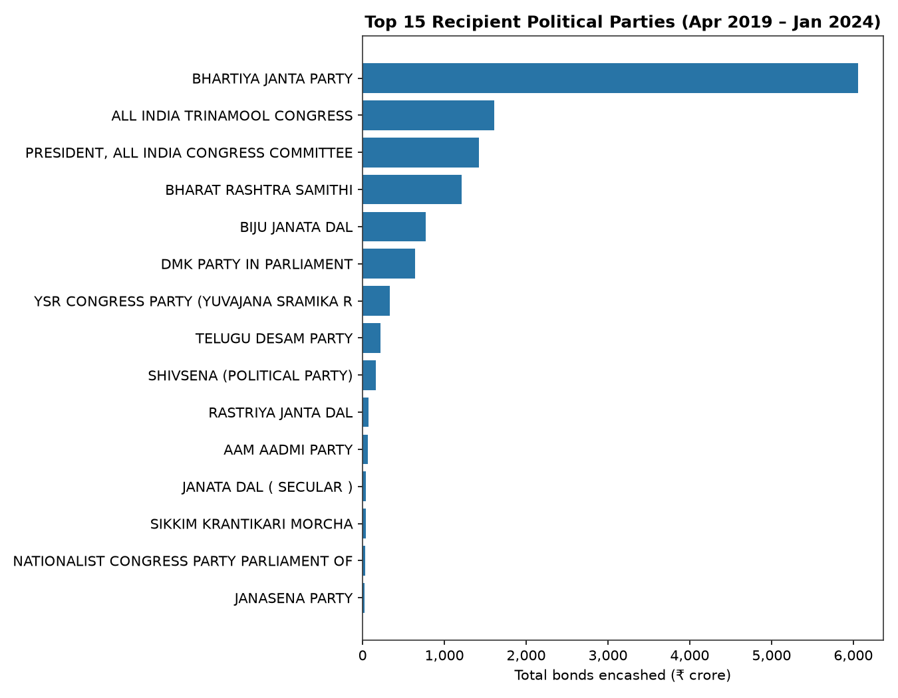
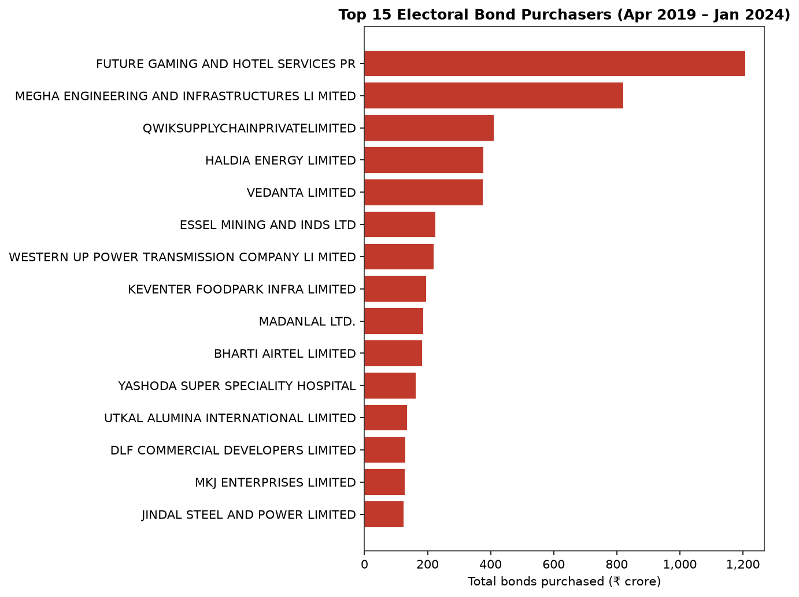
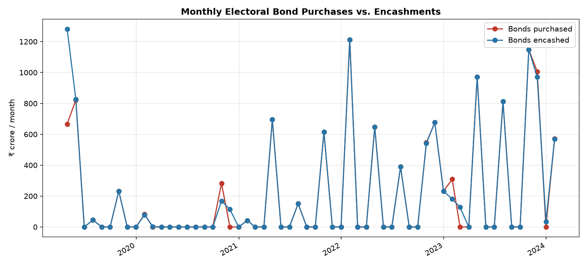
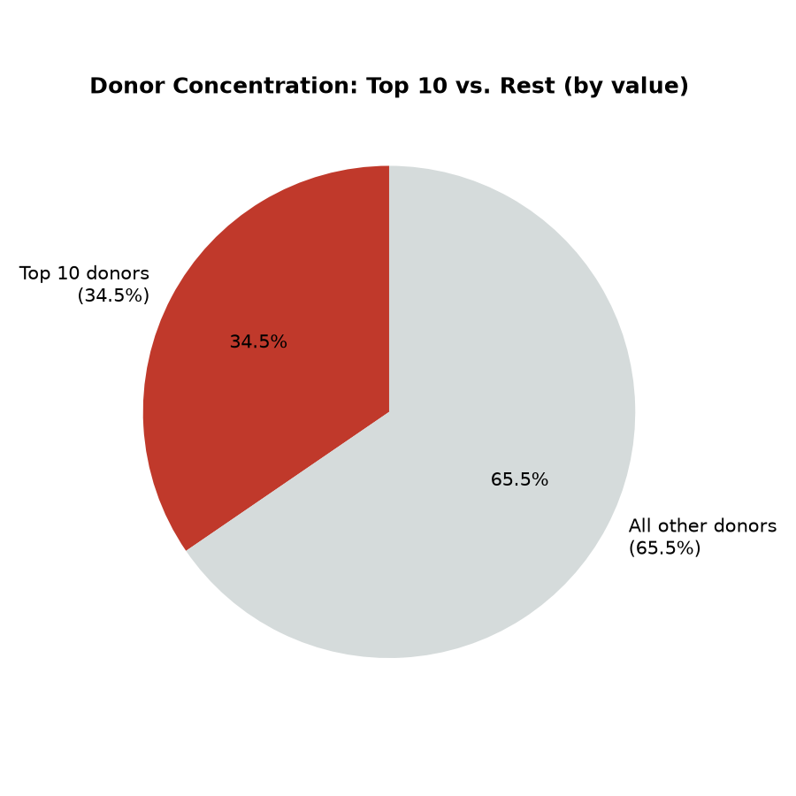
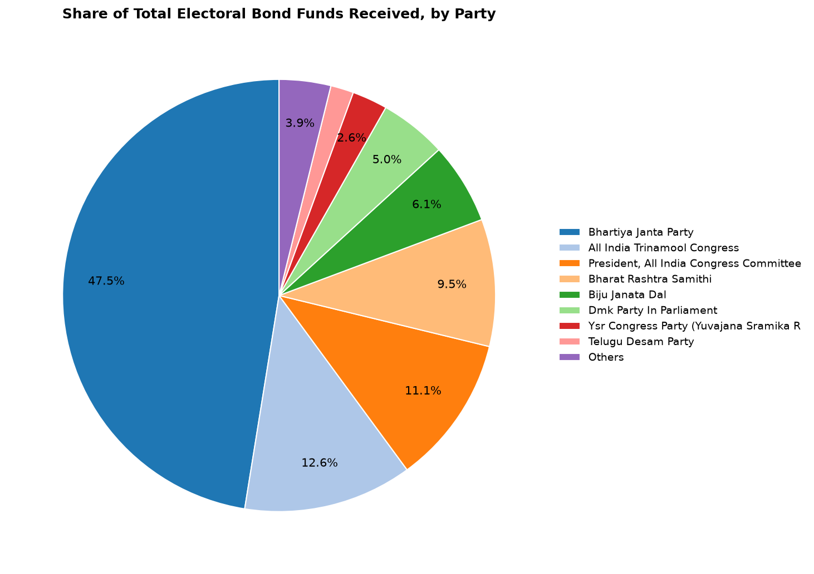

# Electoral Bond Analysis 🇮🇳

An exploratory data analysis of the **Electoral Bond** dataset released following the Supreme Court of India's landmark February 2024 judgment striking down the scheme as unconstitutional. This project cleans, merges, and visualises the official donor (purchase) and party (encashment) disclosures published by the State Bank of India (SBI) and collated by the Election Commission of India (ECI), to answer a simple question: **who funded whom, and how much?**

<p align="center">
  
</p>

## Background: What were Electoral Bonds?

The Electoral Bond Scheme was introduced by the Government of India via the Finance Act, 2017 and notified in January 2018. It allowed individuals and Indian companies to donate money to registered political parties **anonymously**, through interest-free bearer instruments purchased from specified branches of the **State Bank of India (SBI)**.

Key mechanics of the scheme:

- Bonds were issued in fixed denominations of ₹1,000, ₹10,000, ₹1,00,000, ₹10,00,000 and ₹1,00,00,000.
- They were sold to donors (after standard KYC) during specified 10-day sale windows, roughly four times a year.
- A bond was valid for only 15 days, within which it had to be deposited by the receiving political party into a designated bank account.
- Only parties that had secured at least 1% of votes polled in the most recent Lok Sabha or state assembly election were eligible to receive bonds.
- Crucially, **the donor's identity was not disclosed to the receiving party, the public, or the Election Commission** — only SBI held that KYC record.

### The Supreme Court verdict (February 2024)

On **15 February 2024**, a five-judge Constitution Bench of the Supreme Court of India, led by then Chief Justice D.Y. Chandrachud, unanimously struck down the Electoral Bond Scheme in *[Association for Democratic Reforms v. Union of India](https://en.wikipedia.org/wiki/Association_for_Democratic_Reforms_v._Union_of_India)*. The Court held that the scheme's anonymity provisions violated the citizens' **right to information under Article 19(1)(a)** of the Constitution, which is essential to voters making an informed choice about the parties funding their representatives. The Court directed SBI to:

1. Immediately stop the issuance of further electoral bonds.
2. Disclose to the Election Commission every bond purchased since **12 April 2019** (the date the scheme survived an earlier interim SC order), along with the purchaser, denomination, and date.
3. Disclose every bond encashed by political parties over the same period, with the receiving party, denomination, and date.

The ECI subsequently published SBI's disclosures in mid-March 2024, and it is this public dataset — **covering 12 April 2019 to 24 January 2024** — that this project analyses.

## Dataset

| File | Rows | Description |
|---|---|---|
| [`donor.csv`](donor.csv) | 19,207 | Every bond **purchased**: date of purchase, purchaser name, denomination (₹). |
| [`party.csv`](party.csv) | 20,846 | Every bond **encashed**: date of encashment, political party name, denomination (₹). |

Note that the raw files link donors to parties only *in aggregate* — there is no per-bond donor↔party pairing in the public data, since that link was never recorded even by SBI in a directly matchable way. Analysis here is therefore done independently on the purchase side (who gave) and the encashment side (who received).

## What the notebook does

[`Electoral bond Project.ipynb`](Electoral%20bond%20Project.ipynb) walks through the full analysis:

1. **Load & clean** — reads both CSVs into pandas, drops incomplete rows.
2. **Compress duplicate entries** — the raw disclosure repeats a row once per physical bond note; adjacent identical `(date, name)` rows are merged into a single record carrying a `count` and summed `denomination`, converted to ₹ crore for readability.
3. **Ad-hoc search cells** — helper cells to filter by donor/party name substring (e.g. `df_donor[df_donor['donor'].str.contains("TORRENT")]`) or by funding amount/date range.
4. **Interactive Plotly visualisations** — a bond-lifetime timeline (purchase → 15-day expiry) overlaid with party encashment scatter/bar plots, filterable by year.

## Reproducible charts

Since the notebook's Plotly figures are interactive (and don't render as static images in a repo preview), [`generate_charts.py`](generate_charts.py) reimplements the same cleaning pipeline as a standalone script and exports a set of static, presentation-ready PNGs to `charts/`:

```bash
pip install -r requirements.txt
python generate_charts.py
```

### Results

**Top purchasers of electoral bonds** (₹ crore, Apr 2019 – Jan 2024):

<p align="center"></p>

**Top recipient political parties**:

<p align="center"></p>

**Monthly purchase vs. encashment volume** — purchases cluster tightly into ~146 official sale-window dates, while encashments are spread across the year as parties deposit bonds within their 15-day validity:

<p align="center"></p>

**Donor concentration** — how much of total bond value came from just the largest few purchasers:

<p align="center"></p>

**Share of funds received, by party**:

<p align="center"></p>

> Figures are computed directly from the released dataset at run time — see the console output of `generate_charts.py` for exact totals (~₹12,156 crore purchased / ~₹12,769 crore encashed over the disclosure window; the two totals differ slightly because purchase and encashment records don't share a 1:1 window with the analysis cut-off dates, and a handful of bonds purchased were never encashed).

## Getting started

```bash
git clone git@github.com:arihantjain124/ElectoralBond.git
cd ElectoralBond
pip install -r requirements.txt

# Run the notebook
jupyter notebook "Electoral bond Project.ipynb"

# Or regenerate the static comparison charts
python generate_charts.py
```

## Repository structure

```
ElectoralBond/
├── Electoral bond Project.ipynb   # Main exploratory analysis (pandas + Plotly)
├── generate_charts.py             # Standalone script → static PNG charts
├── donor.csv                      # Raw SBI disclosure: bonds purchased
├── party.csv                      # Raw SBI disclosure: bonds encashed
├── charts/                        # Generated comparison images
└── requirements.txt
```

## Data source & citations

- Election Commission of India — [Electoral Bonds disclosure data](https://www.eci.gov.in/), published March 2024 pursuant to Supreme Court directions (raw data as released, re-hosted here for analysis as CSV).
- Association for Democratic Reforms & Anr. v. Union of India & Ors., Writ Petition (Civil) No. 880 of 2017, Supreme Court of India, judgment dated 15 February 2024. [Wikipedia summary](https://en.wikipedia.org/wiki/Association_for_Democratic_Reforms_v._Union_of_India) · [Supreme Court Observer case background](https://www.scobserver.in/cases/association-for-democratic-reforms-electoral-bonds-case-background/)
- JURIST, ["India Supreme Court strikes down electoral bonds scheme"](https://www.jurist.org/news/2024/02/india-supreme-court-strikes-down-electoral-bonds-scheme/), Feb 2024.
- Carnegie Endowment for International Peace, ["Electoral Bonds Prize Anonymity, You Won't Know Who's Bought Them"](https://carnegieendowment.org/posts/2018/01/electoral-bonds-prize-anonymity-you-wont-know-whos-bought-them), Jan 2018 — background on scheme mechanics.
- Association for Democratic Reforms (ADR), [analysis of SBI electoral bond disclosures](http://adrindia.org/content/sc-sbi-saga-what-happens-electoral-bonds-now).

## Disclaimer

This is an independent, non-partisan exploratory analysis built on publicly released government/court-ordered disclosure data. It does not establish any causal link between donations and policy decisions; figures represent aggregate reported purchase/encashment values only. Cross-check any figure you plan to cite against the original ECI-published dataset.

## License

Analysis code (`generate_charts.py`, notebook) is provided as-is for educational and research purposes. Underlying data (`donor.csv`, `party.csv`) is public disclosure data released by the Election Commission of India / State Bank of India.
